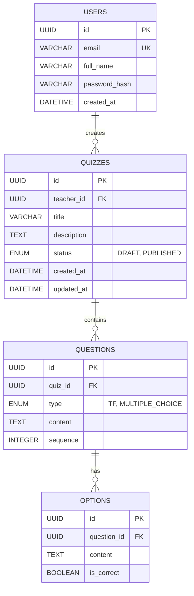

# Data Model

```mermaid
erDiagram
    USERS ||--o{ QUIZZES : "creates"
    QUIZZES ||--o{ QUESTIONS : "contains"
    QUESTIONS ||--o{ OPTIONS : "has"

    USERS {
        UUID id PK
        VARCHAR email UK
        VARCHAR full_name
        VARCHAR password_hash
        DATETIME created_at
    }

    QUIZZES {
        UUID id PK
        UUID teacher_id FK
        VARCHAR title
        TEXT description
        ENUM status "DRAFT, PUBLISHED"
        DATETIME created_at
        DATETIME updated_at
    }

    QUESTIONS {
        UUID id PK
        UUID quiz_id FK
        ENUM type "TF, MULTIPLE_CHOICE"
        TEXT content
        INTEGER sequence
    }

    OPTIONS {
        UUID id PK
        UUID question_id FK
        TEXT content
        BOOLEAN is_correct
    }
```
