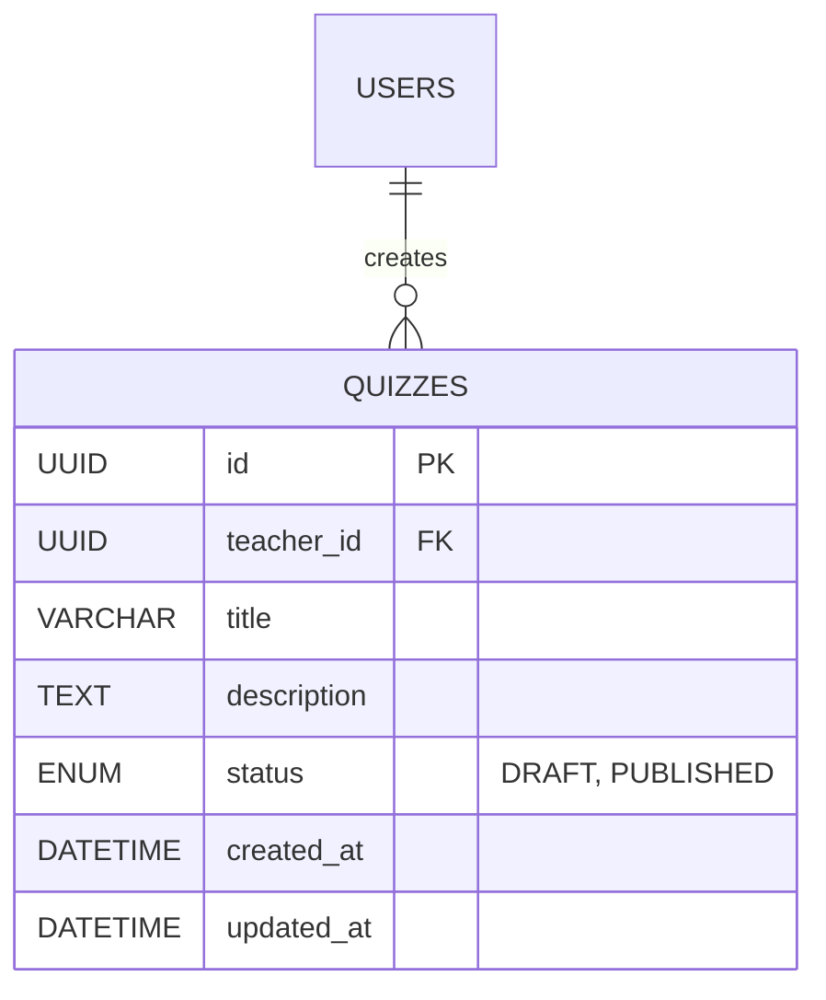

# Data Model

```mermaid
erDiagram
    USERS ||--o{ QUIZZES : "creates"

    QUIZZES {
        UUID id PK
        UUID teacher_id FK
        VARCHAR title
        TEXT description
        ENUM status "DRAFT, PUBLISHED"
        DATETIME created_at
        DATETIME updated_at
    }
```
